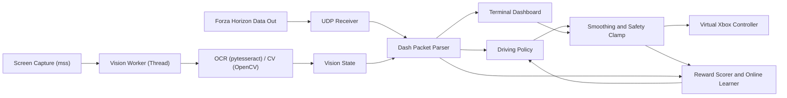

# Forza AI Design

## Primary Target

The primary game target is Forza Horizon on Windows PC. The program expects the official Data Out UDP telemetry feature and uses the Horizon Dash packet profile by default.

The Horizon profile is first-class because it exposes enough structured data for useful learning:

- Car motion: speed, local velocity, acceleration, yaw, pitch, roll, angular velocity.
- Driver inputs: steer, accel, brake, clutch, handbrake, gear.
- Race/free-roam state: race-on flag, lap number, race position, lap timing when available.
- Route state: manual `--track` labels and position.
- Tire behavior: slip ratio, slip angle, combined slip, and temperatures.

## Training Strategy

The first model is imitation learning. You drive clean routes, the recorder saves telemetry and your controller inputs, then the trainer learns to predict those inputs from the telemetry frame.

Dash packets expose `accel` and `brake` as 0-255 driver-input values. The program normalizes these into throttle/brake values from 0.0 to 1.0 for labels, dashboard display, and controller comparison.

Horizon free roam can report `is_race_on = 0` even when usable telemetry is arriving. For Horizon, the program treats a packet as drivable when it has speed/control fields and the speed or live controls indicate real driving activity.

The standard Horizon UDP packet does not appear to expose on-screen skill score or unspent skill points. The reward system still supports score fields from another reader by looking for aliases such as `skill_score`, `skill_points`, `skill_chain`, `score`, and `points`.

Car identity is included in learning through telemetry fields such as `car_ordinal`, engine RPM range, cylinder count, car class, performance index, and drivetrain type.

Redline is learned per car during telemetry. Frames are enriched with `learned_redline_rpm`, `learned_redline_confidence`, and `max_observed_rpm`; reward logic uses the learned estimate once confidence is high enough and otherwise falls back to `engine_max_rpm`.

The modes are:

- Named Horizon model: train with a name such as `open-road`, `airport-drift`, or `highway-loop`.
- Typed Horizon model: group different behavior families with `--type`, such as `driving`, `skills`, or `racing`.
- Motorsport fallback model: available with `configs/motorsport.toml` and optional `track_ordinal` filtering.
- Self-training model: optional online learner that scores the previous action after the next telemetry frame arrives.

Named paths follow the project structure:

- Recordings: `data/<type>/<name>.jsonl`
- Offline models: `models/<type>/<name>.joblib`
- Online self-training models: `models/<type>/<name>-online.joblib`

Transmission mode is configured per run as `automatic`, `manual`, or `manual-clutch`. Horizon telemetry exposes gear and clutch input, but not the assist-menu transmission setting, so the configured mode is the source of truth. Telemetry is used as a sanity check, especially to notice clutch input that suggests manual-with-clutch behavior.

Terrain is inferred from telemetry instead of a direct Horizon road flag. Each frame can be enriched with `terrain_state`, `terrain_confidence`, `terrain_offroad_score`, `terrain_road_score`, `terrain_is_road`, and `terrain_is_offroad`. The CLI accepts `--terrain-preference {auto,road,offroad,mixed}` for recording and driving. `auto` resolves `racing` to `road`; `skills` and other types resolve to `mixed`.

The off-road threshold is intentionally sensitive to the live Horizon sample where wheel rumble stayed zero but surface rumble and tire slip were high. Sustained surface rumble plus high combined slip/slip ratio should classify as off-road.

## Rewards and Punishments

The online learner rewards movement through the world, forward motion, speed gain, fast RPM climb through the useful band below redline, small sustained high-speed bonuses, and clean upshifts that land below redline. Horizon can leave `distance_traveled` at zero, so movement falls back to position delta when needed.

Terrain rewards are preference-based: road preference rewards clean road movement, multiplies the bonus when all four wheels are confidently on the road, and heavily penalizes off-road with enough weight to beat acceleration/progress rewards; offroad preference rewards controlled off-road movement; mixed preference leaves terrain neutral while existing slip/stall penalties still apply.

It punishes signals that usually mean the car is being mishandled:

- High tire combined slip.
- Lateral sliding or spinning instead of stable forward motion.
- Large driving-line error.
- Redlining while still applying throttle, with stronger punishment over max RPM.
- Throttle while the AI brake signal suggests braking.
- Throttle/brake overlap.
- Meaningful throttle that does not produce speed gain or world movement.
- Applying throttle while the car is stalled or barely moving.

The reward score changes how strongly the online learner trains on the last action. Negative transitions also adjust the target by reducing throttle, trimming steering, or adding a little braking before the sample is learned.

When skill score fields are available, positive score deltas become the strongest reward. This lets the same online learner pivot from "drive cleanly" to "go for skill points" without replacing the control model.

## Runtime Loop

## Vision Integration

The vision pipeline runs in a background thread to avoid blocking the high-frequency telemetry and controller loops. It is designed to scale with high-refresh monitors (up to 144Hz and beyond) by sampling asynchronously.

- **OCR Helper:** Uses `pytesseract` to detect pause menus, route prompts, and skill score gains.
- **CV Helper:** Uses OpenCV (Canny/Hough) to identify road boundaries and provide a `vision_lane_offset` signal.
- **Policy Augmentation:** The `CautiousFallbackPolicy` blends the visual lane offset with the telemetry-based driving line for more robust steering.
- **Reward Enrichment:** The online learner treats detected skill score gains as a high-reward signal and penalizes driving inputs when a menu is detected.

## Safety

- The controller is neutralized when the drive command exits.
- Outputs are clipped to valid controller ranges.
- Steering, throttle, and brake changes are smoothed frame-to-frame.
- `--dry-run` lets the loop run without creating controller input.
- The terminal dashboard can pause/resume, send neutral controls, show status, or stop the run.
